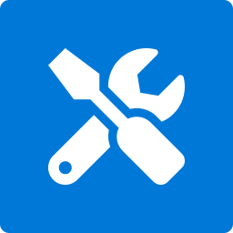

<div id="top"></div>

[![Contributors][contributors-shield]][contributors-url]
[![Forks][forks-shield]][forks-url]
[![Stargazers][stars-shield]][stars-url]
[![Issues][issues-shield]][issues-url]
[![MIT License][license-shield]][license-url]

<!-- PROJECT LOGO -->
<br />
<div align="center">
  <a href="https://github.com/joachimdalen/azext">
    
  </a>

<h3 align="center">AzExt - Azure DevOps Extension Tools</h3>

  <p align="center">
    A collection of tools to help with developing extensions for Azure DevOps.
    <br />
    <a href="https://github.com/joachimdalen/azext"><strong>Explore the docs »</strong></a>
    <br />
    <br />
    <a href="https://www.npmjs.com/package/@joachimdalen/github-org-exists">View Package</a>
    ·
    <a href="https://github.com/joachimdalen/azext/blob/master/docs/CHANGELOG.md">Changelog</a>
    ·
    <a href="https://github.com/joachimdalen/azext/issues">Report Bug</a>
    ·
    <a href="https://github.com/joachimdalen/azext/issues">Request Feature</a>
  </p>
</div>

<!-- TABLE OF CONTENTS -->
<details>
  <summary>Table of Contents</summary>
  <ol>
    <li>
      <a href="#about-the-project">About The Project</a>
      <ul>
        <li><a href="#limitations">Limitations</a></li>
      </ul>
    </li>
    <li>
      <a href="#getting-started">Getting Started</a>
      <ul>
        <li><a href="#prerequisites">Prerequisites</a></li>
        <li><a href="#installation">Installation</a></li>
      </ul>
    </li>
    <li><a href="#usage">Usage</a></li>
    <li><a href="#roadmap">Roadmap</a></li>
    <li><a href="#contributing">Contributing</a></li>
    <li><a href="#license">License</a></li>
    <li><a href="#contact">Contact</a></li>
    <li><a href="#acknowledgments">Acknowledgments</a></li>
  </ol>
</details>

<!-- ABOUT THE PROJECT -->

## About The Project

AzExt provides a set of utilities to help with developing Extensions for Azure DevOps.


## Configuration

```json
{
  // Idenfier of repository for issues and pull requests
  "repository": "joachimdalen/AzureDevOpsExtensions", 
  // Format of title for main release - Example:  ## 0.0.1 (2020-10-01)
  "releaseTitleFormat": "## {{version}} ({{publishDate}})", 
  // Format of title for extension part (e.g task) - Example: #### `BuildTaskOne@2.1.45`
  "moduleTitleFormat": "#### `{{name}}@{{version}}`", 
  "taskMapping": {},
  "sectionSplitter": "---",
  // This maps to the type field and provides headers for specific types
  "tagMapping": {
    "feature": "### 🚀 Features",
    "fix": "### 🐛 Fixes",
    "tests": "### 🧪 Tests",
    "other": "### 💬 Other",
    "docs": "### Documentation"
  }, 
  "attributionTitleFormat": "## 🌟 Contributors",
  "attributionSubTitle": "Thank you to the following for contributing to the latest release",
  // This is the known authors that should not have their contributions listed in the changelog
  "knownAuthors": ["joachimdalen"],
  // Use issue title instead of number in links
  "useDescriptiveIssues": true 
}
```

## Getting Started

This is an example of how you may give instructions on setting up your project locally.
To get a local copy up and running follow these simple example steps.

### Installation

```sh
  npm install -g @joachimdalen/azext
```

### Developing

1. Clone the repo
   ```sh
   git clone https://github.com/joachimdalen/azext.git
   ```
2. Install dependencies
   ```sh
   > npm install
   ```
3. Build package
   ```sh
   > npm run build
   ```

<p align="right">(<a href="#top">back to top</a>)</p>

<!-- USAGE EXAMPLES -->

## Usage


<p align="right">(<a href="#top">back to top</a>)</p>

<!-- ROADMAP -->

## Roadmap

- [ ] README generation from multiple files
- [ ] Creation of new repository from default template


See the [open issues](https://github.com/joachimdalen/azext/issues?q=is%3Aopen+is%3Aissue+label%3A%40type%2Ffeature) for a full list of proposed features.

<p align="right">(<a href="#top">back to top</a>)</p>

<!-- CONTRIBUTING -->

## Contributing

Contributions are welcome, both in the form of suggestions and code. Create

If you want to contribute code, I ask that you follow some guidelines.

- New and changed features should to the best ability be covered by tests
- Follow the branching policy:
  - `feature/` for new features
  - `bugfix/` for bug fixes
  - `docs/` for documentation changes
- If your change is related to an issue, use the id as the first part of the branch e.g `bugfix/12-fix-crash-when-updating-rule`
- Pull requests should target the `develop` branch

1. Fork the Project
2. Create your Feature Branch (`git checkout -b feature/AmazingFeature`)
3. Commit your Changes (`git commit -m 'Add some AmazingFeature'`)
4. Push to the Branch (`git push origin feature/AmazingFeature`)
5. Open a Pull Request

<p align="right">(<a href="#top">back to top</a>)</p>

<!-- LICENSE -->

## License

Distributed under the MIT License. See `LICENSE` for more information.

<p align="right">(<a href="#top">back to top</a>)</p>

<!-- CONTACT -->

## Contact

If you have generic questions about the project or usage you can make contact in the following ways:

- Submit an issue with the `@type/question` label - [New Issue](https://github.com/joachimdalen/azext/issues/new)


<p align="right">(<a href="#top">back to top</a>)</p>

[contributors-shield]: https://img.shields.io/github/contributors/joachimdalen/azext.svg?style=for-the-badge
[contributors-url]: https://github.com/joachimdalen/azext/graphs/contributors
[forks-shield]: https://img.shields.io/github/forks/joachimdalen/azext.svg?style=for-the-badge
[forks-url]: https://github.com/joachimdalen/azext/network/members
[stars-shield]: https://img.shields.io/github/stars/joachimdalen/azext.svg?style=for-the-badge
[stars-url]: https://github.com/joachimdalen/azext/stargazers
[issues-shield]: https://img.shields.io/github/issues/joachimdalen/azext.svg?style=for-the-badge
[issues-url]: https://github.com/joachimdalen/azext/issues
[license-shield]: https://img.shields.io/github/license/joachimdalen/azext?style=for-the-badge
[license-url]: https://github.com/joachimdalen/azext/blob/master/LICENSE